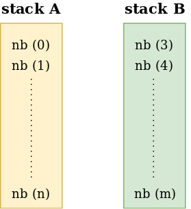

# Push_swap

## Project Description

Push_swap is a 42 project made for sorting algorithm exploration. The constraint of the project (use of two heaps) obliges you to design you own sorting algorithm.

To realize the sorting algorithm we must use 2 stacks (structured as we want in our code) 


<p align="center">

<p/>

and the following operations :

| Operation | Description |
| --- | --- |
|sa  | swap a - swap the first 2 elements at the top of stack a|
|sb  | swap b - swap the first 2 elements at the top of stack b|
|ss  | sa and sb at the same time|
|pa  | push a - take the first element at the top of b and put it at the top of a|
|pb  | push b - take the first element at the top of a and put it at the top of b|
|ra  | rotate a - shift up all elements of stack a by 1. The first element becomes the last one|
|rb  | rotate b - shift up all elements of stack b by 1. The first element becomes the last one|
|rr  | ra and rb at the same time|
|rra | reverse rotate a - shift down all elements of stack a by 1. The last element becomes the first one|
|rrb | reverse rotate b - shift down all elements of stack b by 1. The last element becomes the first one|
|rrr | rra and rrb at the same time|

In this project, two programs must be realized. The first one, called `push_swap`, must show the needed operations to sort the given numbers. To be considered sorted, all the numbers must be on stack A with the minimum on top of the stack.

```
$> ./push_swap "5 3 9 1 4"
rra
rra
pb
rra
rra
pb
ra
pa
pa
```

The second one, called `checker`, must ensure that with the given numbers and operations the stack is sorted.

```
$> ./push_swap "5 3 9 1 4" | ./checker "5 3 9 1 4"
OK
$> echo "sa" | ./checker "5 3 9 1 4"
KO
```